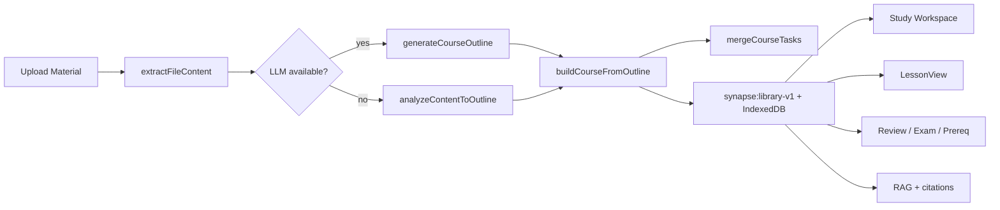

# Synapse Learning — Architecture

This document describes how data flows from upload to study, the main modules, and where to extend the system.

## High-level data flow



**Critical gate:** `gatherAnalyzedText()` requires `extractedText` length ≥ 80 in analyzed files. Without uploads, workspace tools show empty states — never demo Cournot content (unless demo mode is on).

## Upload & course pipeline

| Module | Role |
| ------ | ---- |
| `uploadPipeline.ts` | File read (PDF/DOCX/TXT/MD), `processUpload`, course assembly |
| `contentAnalysis.ts` | Offline outline v2: sections, RAKE+TextRank, definitions, prerequisites |
| `courseGenerator.ts` | LLM outline when proxy/API available |
| `taskGenerator.ts` | Tasks from generated course topics |

Upload path: **UploadModal → `processUpload`** (not `simulateUpload`).

### Outline → course

```
extractedText
  → analyzeContentToOutline | generateCourseOutline
  → buildCourseFromOutline
  → Course { topics, lessons, glossary }
  → mergeCourseTasks
  → persistLibrary
```

## Study Workspace (11 tools)

Orchestrated by `workspaceNoteContent.ts` → `buildWorkspaceNoteBundle()`.

| Tool | Extractor / builder |
| ---- | ------------------- |
| Concept map | `buildConceptMapFromCourse` |
| Sandbox | `notesSupportEconomicsSandbox`, `sandboxInsightFromNotes` |
| Leitner | `buildFlashcards` |
| Compare | `extractComparisons` |
| Whiteboard | Canvas + **note formulas sidebar** (`extractFormulas`) |
| Feynman | `buildFeynmanOutline`, `buildFeynmanGaps` |
| Timer | Local session timer |
| Debate | `buildDebateTreeFromNotes` |
| Reader | `relevantExcerpt` |
| Scratchpad | `extractFormulas` + economics solvers (partial) |
| Source / annotations | Per-file local annotations |

All extractors live in `noteContentExtractors.ts`. Semantic step content uses `groundedLesson.ts` → `getNoteContentForLessonStep()`.

## Task flows (note-grounded)

`taskFlowContent.ts` resolves content for task overlays:

| Task type | Resolver | Source |
| --------- | -------- | ------ |
| Review / flashcards | `resolveReviewCards` | `buildFlashcards` |
| Exam prep | `resolveExamQuestions` | Glossary MCQ, sentence ID, cloze |
| Prerequisite repair | `resolvePrerequisiteSteps` | Course prerequisites + definitions |
| Practice | `buildPracticeExercisesFromNotes` | Worked examples, code blocks, formulas |

`App.tsx` builds `TaskFlowContext` from store uploads + active task course.

## Lesson surfaces

| View | Grounding |
| ---- | --------- |
| `LessonView` | `buildWorkspaceNoteBundle` + `generateLessonPanels` (LLM) + `GroundedLessonContent` |
| `PracticalLessonView` | `buildPracticeExercisesFromNotes` — empty state if no source |
| `StudyWorkspace` | Full note bundle per tool |

## Agent & RAG

| Module | Role |
| ------ | ---- |
| `rag.ts` | BM25 retrieval over uploads |
| `sourceContext.ts` | Optional embedding rerank, chunk assembly |
| `llmClient.ts` | Chat completions (direct or via proxy) |

Agent responses include citations when source chunks are found.

## Persistence

| Layer | Module | Notes |
| ----- | ------ | ----- |
| localStorage | `persistence.ts`, `libraryStorage.ts` | Metadata + small text |
| IndexedDB | `indexedDbStorage.ts` | `extractedText` ≥ 48KB offloaded by file id |
| Session | `useStore.ts` | `synapse:session-v2` learner/tasks/activities |

Hydration: on app load, `hydrateLibrary()` merges IDB text back into `uploadedFiles`.

## Pedagogy & analytics

| Module | Role |
| ------ | ---- |
| `pedagogy.ts` | FSRS, beta mastery, prerequisite repairs |
| `activityAnalytics.ts` | Heatmap + streak from real `activities` |
| `useStore.ts` | `logActivity`, `recordQuizAttempt`, task completion |

Demo learner metrics are empty unless **Demo showcase** is enabled.

## Demo isolation

| Module | Role |
| ------ | ---- |
| `demoMode.ts` | `MOCK_COURSE_IDS`, `visibleCourses`, `visibleTasks`, `shouldShowDemo` |
| `src/demo/mockData.ts` | Seeded courses / tasks / mistakes / agent messages (only loaded when `showDemoContent: true`) |
| `src/demo/domainContentDemo.ts` | Demo lesson copy (Cournot/Bertrand) |
| `src/demo/activityDemo.ts` | Seeded activity log |

Default: `showDemoContent: false`.

## Backend (Phase 6)

Express server in `server/` — JWT auth, OpenAI-compatible `/v1/chat/completions` and `/v1/embeddings`, usage metering with plan-aware quotas, library + session sync, real Stripe billing, admin stats, YouTube transcript proxy, and Postgres persistence managed by `node-pg-migrate`. The client is fully wired to all of this:

| Surface | Server | Client wire |
| ------- | ------ | ----------- |
| Login / register / me | `/auth/*` | `authClient.ts`, `Settings.tsx` |
| Library sync | `GET/PUT /v1/library` | `librarySync.ts`, `pullLibraryFromServer` / `pushLibraryToServer` |
| Session sync | `GET/PUT /v1/session` | `sessionSync.ts`, `pull/pushSessionToServer`, auto-pull on login |
| Billing | `POST /v1/billing/checkout`, `GET /v1/billing/status`, `POST /v1/billing/webhook` | `Settings.tsx` Upgrade buttons + redirect refresh |
| YouTube | `GET /v1/youtube/transcript` | `youtubeTranscript.ts` invoked from `processUpload` |
| Admin | `GET /v1/admin/stats` | (Operator only — not exposed in UI) |

Postgres tables (`accounts`, `account_libraries`, `account_sessions`) are versioned in `server/migrations/` and applied via `npm run migrate` or automatically with `RUN_MIGRATIONS_ON_START=true`.

See [server/README.md](server/README.md), [API.md](API.md), [SECURITY.md](SECURITY.md).

## Extension points (remaining)

1. **Local offline embeddings** — drop the proxy/key dependency by shipping a transformers.js model.
2. **OCR + audio pipelines** — extend `uploadPipeline` for image and audio sources (Tesseract/Whisper-WASM).
3. **Server-side RAG index** — index synced uploads server-side for cross-device retrieval.
4. **Refresh tokens / email verify / password reset** — auth lifecycle.
5. **Collaborative annotations + whiteboard** — multi-user shared state.
6. **Teacher / class dashboard** — surface admin stats + per-student progress.

## Key files index

```
src/lib/contentAnalysis.ts          Offline outline engine (RAKE+TextRank, sections, prereqs)
src/lib/noteContentExtractors.ts    Per-tool extractors + quiz + BM25 unified
src/lib/workspaceNoteContent.ts     Workspace bundle assembler
src/lib/taskFlowContent.ts          Review/exam/prereq from notes
src/lib/practiceExercises.ts        Practical lessons from notes
src/lib/groundedLesson.ts           Section-aware lesson steps
src/lib/rag.ts                      BM25 retrieval + chunking
src/lib/sourceContext.ts            Hybrid (BM25 + embedding) reranker
src/lib/conceptEdges.ts             Course-derived prereq edges
src/lib/identity.ts                 Production-safe user identity helpers
src/lib/formulaSolver.ts            Generic formula evaluator
src/lib/youtubeTranscript.ts        Client-side YouTube transcript fetch
src/lib/librarySync.ts / sessionSync.ts  Server pull/push + merge
src/lib/authClient.ts               /auth/* + /v1/billing helpers
src/lib/libraryStorage.ts           localStorage + IDB hybrid
src/store/useStore.ts              App state + upload handler
src/components/workspace/StudyWorkspace.tsx  11-tool shell
```
